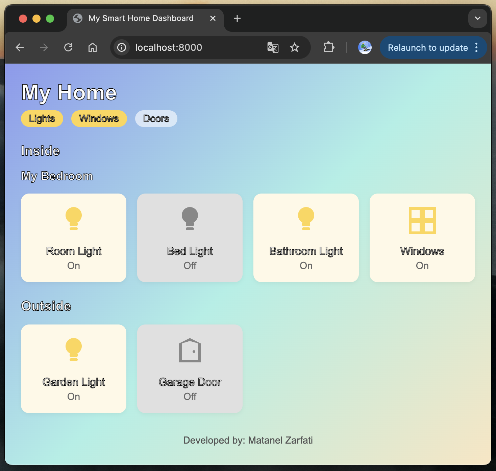

# AI Voice Assistant

**Author:** Matanel Zarfati  
**Program:** B.Sc. Computer Science  
**Platform:** Python 3.13  
**License:** All rights reserved. See [License](#license).

AI Voice Assistant is a local-first Python smart-home voice assistant that listens to voice commands, processes them using speech recognition and an LLM, validates the generated commands, and updates a local smart-home dashboard.

The project focuses on privacy, local execution, deterministic validation, and a simple web-based interface for monitoring smart-home device states.

---

## Demo



---

## Overview

Commercial voice assistants usually depend on remote cloud services. This project demonstrates a privacy-focused alternative that can run locally on a personal computer.

The assistant uses speech recognition to transcribe the user's voice, an LLM to convert natural language commands into structured numeric actions, and a deterministic validation layer to make sure only valid smart-home actions are applied.

The system updates a local `devices.json` file and displays the current device states through a static HTML, CSS, and JavaScript dashboard.

---

## Architecture

```text
Voice Command
     ↓
Speech Recognition
     ↓
LLM Command Parser
     ↓
Deterministic Validation Layer
     ↓
devices.json
     ↓
Local Web Dashboard
```

---

## Features

- Wake-word based assistant using the name "Mia"
- Speech-to-text command transcription
- LLM-based natural language command parsing
- Numeric command-code system for smart-home actions
- Deterministic validation of LLM output
- Conflict handling by keeping the latest state per device
- Routine support for approved multi-action commands
- Atomic updates to the smart-home state file
- Local web dashboard for monitoring device states
- Text-to-speech feedback after command processing

---

## Technologies

- Python 3.13
- Faster-Whisper
- SpeechRecognition
- llama.cpp / llama-cpp-python
- Mistral-7B-Instruct GGUF model
- HTML
- CSS
- JavaScript
- JSON
- Local HTTP server

---

## Repository Layout

```text
AI_VoiceAssistant.py
prompt_llm/
  command_prompt.txt
  default_prompt_1.txt
  default_prompt_2.txt
  default_prompt_3.txt
  routine_prompt.txt
server_smart_home/
  devices.json
  index.html
  script.js
  style.css
assets/
  smart-home-dashboard.png
README.md
LICENSE
requirements.txt
.gitignore
```

---

## Quick Start

### 1. Create a virtual environment

```bash
python3.13 -m venv .venv
source .venv/bin/activate
pip install --upgrade pip
```

On Windows:

```bash
py -3.13 -m venv .venv
.venv\Scripts\activate
pip install --upgrade pip
```

### 2. Install dependencies

```bash
pip install -r requirements.txt
```

### 3. Download the required models

This repository does not include large AI model files.

You need to download:

- A GGUF version of Mistral-7B-Instruct, for example `Q4_K_M`
- A Faster-Whisper model, such as `small.en` or another compatible model

After downloading the models, update the relevant model paths inside:

```text
AI_VoiceAssistant.py
```

### 4. Run the assistant

```bash
python AI_VoiceAssistant.py
```

The local smart-home dashboard runs through a local HTTP server.

Default address:

```text
http://localhost:8000/
```

---

## How It Works

1. The assistant listens for the wake word "Mia".
2. After detecting the wake word, it records the user's follow-up command.
3. The speech recognition component converts the audio into text.
4. The prompt files are combined with the user command.
5. The local LLM returns a structured list of numeric command codes.
6. The validation layer checks that the output is valid and safe.
7. Valid commands are written to `devices.json`.
8. The local dashboard reads the JSON file and updates the device states.
9. The assistant provides short spoken feedback to the user.

---

## Command Validation

The project includes a deterministic validation layer to reduce the risk of applying incorrect LLM output.

The validation logic:

- Rejects unknown command codes
- Rejects malformed responses
- Removes invalid actions
- Resolves duplicate commands by keeping the latest state for each device
- Allows multi-action commands only when they match a defined routine

This approach keeps the LLM flexible while making the final device updates predictable and controlled.

---

## Configuration

Main configuration options are located inside:

```text
AI_VoiceAssistant.py
```

Prompt and command behavior can be adjusted in:

```text
prompt_llm/command_prompt.txt
prompt_llm/routine_prompt.txt
prompt_llm/default_prompt_1.txt
prompt_llm/default_prompt_2.txt
prompt_llm/default_prompt_3.txt
```

The web dashboard files are located in:

```text
server_smart_home/
```

The device states are stored in:

```text
server_smart_home/devices.json
```

---

## Notes

- The project is designed as a local-first assistant.
- Large model files are not included in the repository.
- Microphone permissions may be required depending on the operating system.
- Performance depends on the selected models and the computer hardware.
- The academic report is not included in this repository.

---

## What I Learned

- Designing a local AI assistant architecture
- Integrating speech recognition with an LLM
- Using prompt engineering for structured command generation
- Validating LLM output before applying actions
- Managing smart-home device states with JSON
- Building a local dashboard with HTML, CSS, and JavaScript
- Structuring a Python project for portfolio and academic review

---

## Future Improvements

- Add a graphical configuration page for devices and routines
- Add more automated tests for command validation
- Improve error handling for missing models or microphone issues
- Add support for more smart-home device types
- Add optional HomeKit or MQTT integration
- Package the project with a cleaner installation flow

---

## License

Copyright © 2025 Matanel Zarfati. All rights reserved.

This project is provided for portfolio and academic review purposes only.  
For full license terms, see [LICENSE](LICENSE).

---

## Contact

For questions, academic review, or licensing inquiries, contact Matanel Zarfati.